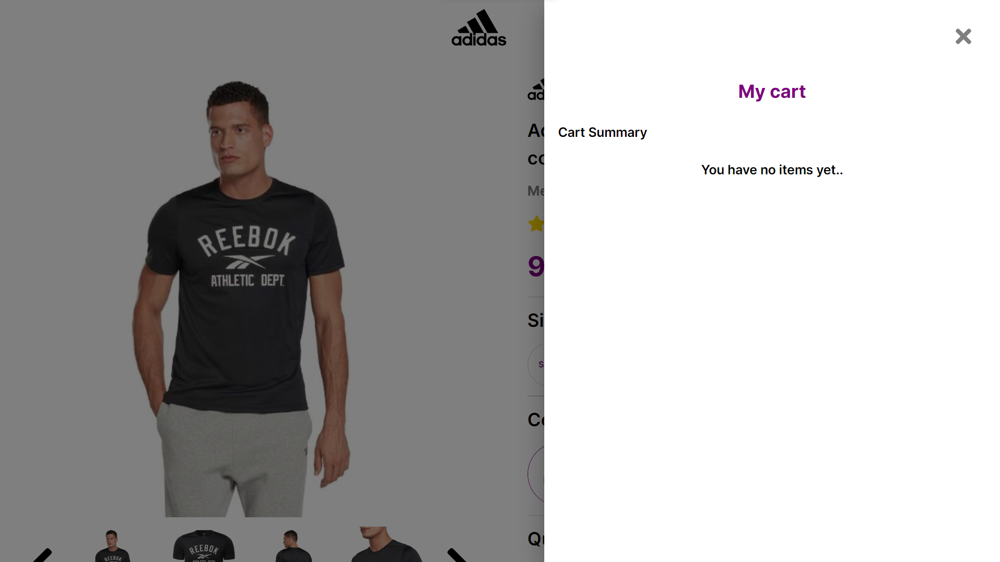

# React-Ecommerce-Task

# A) Links:

<table>
<tr>
<th>Number</th>
<th>Platform</th>
<th>Link</th>
</tr>

<tr>
<td>1</td>
<td>GitHub Pages</td>
<td>https://omarthinks.github.io/React-Ecommerce-Project/</td>
</tr>
<tr>
<td>2</td>
<td>GitHub Repository (and Docs)</td>
<td>https://github.com/OmarThinks/React-Ecommerce-Project</td>
</tr>
<tr>
<td>3</td>
<td>Adobe XD Design</td>
<td>https://xd.adobe.com/view/2186e175-b022-45db-a2f4-c9ba6e4bde30-74d5/</td>
</tr>
<tr>
<td>4</td>
<td>YouTube</td>
<td> ... </td>
</tr>
</table>

# B) About

A task for A React Ecommerce Project.

# C) Images


Home Screens


Empty Drawer


Drawer with an Item

# D) Score:

Building an Ecommerce Application using React for a task

The task is to implement this design in react following these rules:

- File types should be js + jsx ✅ (1/1)
  - Not only js and jsx, but actually all the files are `.tsx`
  - This means that I've used TypeScript for type safety
- File types should be scss ✅ (1/1)
  - I am specialized React Native developer. So I don't use SASS
- Folder structure:
  - public/images for static images. ✅ (1/1)
  - src/images for dynamic images (dummy data images). ✅ (1/1)
  - src/services for api calls (dummy data for the test).
  - src/components for other react components. ✅ (1/1)
  - src/pages for router pages. ✅ (1/1)
- Data should be passed via props or returned by an api. ⚠️ (0/1)
- Should depend on two colors in css variables ( --primary-color , --secondary-color ). ✅ (1/1)
- Should use lazy loading at least at one component. ✅ (1/1)
- Shouldn't use hooks. ⚠️ (0/1)
- Shouldn't use redux. ✅ (1/1)
- The only required functionality is “add to cart”. add to cart functionality can be divided in 2 cases:
  - Empty cart:
    - Cart icon should have a badge containing 0 when cart is empty ✅ (1/1)
    - Clicking on the top cart icon should show the empty cart dropdown ✅ (1/1)
  - Non empty cart:
    - Cart icon should have a badge containing the number of cart items ✅ (1/1)
    - Clicking on the top cart icon should show cart items dropdown ✅ (1/1)
  - In both cases Pressing the "Add to cart" button should increment the items at cart by quantity. ✅ (1/1)
- Task should be delivered as a github public repository ✅ (1/1)
- Task should be deployed to github pages ✅ (1/1)

This is a [Next.js](https://nextjs.org/) project bootstrapped with [`create-next-app`](https://github.com/vercel/next.js/tree/canary/packages/create-next-app).

## Getting Started

First, run the development server:

```bash
npm run dev
# or
yarn dev
# or
pnpm dev
# or
bun dev
```

Open [http://localhost:3000](http://localhost:3000) with your browser to see the result.

You can start editing the page by modifying `app/page.tsx`. The page auto-updates as you edit the file.

This project uses [`next/font`](https://nextjs.org/docs/basic-features/font-optimization) to automatically optimize and load Inter, a custom Google Font.

## Learn More

To learn more about Next.js, take a look at the following resources:

- [Next.js Documentation](https://nextjs.org/docs) - learn about Next.js features and API.
- [Learn Next.js](https://nextjs.org/learn) - an interactive Next.js tutorial.

You can check out [the Next.js GitHub repository](https://github.com/vercel/next.js/) - your feedback and contributions are welcome!

## Deploy on Vercel

The easiest way to deploy your Next.js app is to use the [Vercel Platform](https://vercel.com/new?utm_medium=default-template&filter=next.js&utm_source=create-next-app&utm_campaign=create-next-app-readme) from the creators of Next.js.

Check out our [Next.js deployment documentation](https://nextjs.org/docs/deployment) for more details.
