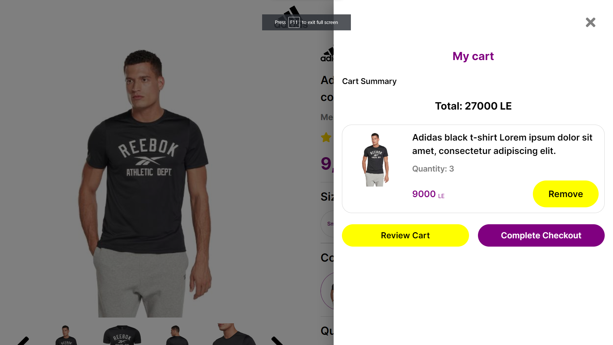

# React-Ecommerce-Task

# A) Links:

<table>
<tr>
<th>Number</th>
<th>Platform</th>
<th>Link</th>
</tr>

<tr>
<td>1</td>
<td>GitHub Pages</td>
<td>https://omarthinks.github.io/React-Ecommerce-Project/</td>
</tr>
<tr>
<td>2</td>
<td>GitHub Repository (and Docs)</td>
<td>https://github.com/OmarThinks/React-Ecommerce-Project</td>
</tr>
<tr>
<td>3</td>
<td>Adobe XD Design</td>
<td>https://xd.adobe.com/view/2186e175-b022-45db-a2f4-c9ba6e4bde30-74d5/</td>
</tr>
<tr>
<td>4</td>
<td>YouTube</td>
<td>https://www.youtube.com/watch?v=GliIv8d2Dis</td>
</tr>
</table>

# B) About

A task for A React Ecommerce Project.

# C) Images

Home Screens

Empty Drawer

Drawer with an Item

# D) Score:

Building an Ecommerce Application using React for a task

The task is to implement this design in react following these rules:

- File types should be js + jsx ✅ (1/1)
  - Not only js and jsx, but actually all the files are `.tsx`
  - This means that I've used TypeScript for type safety
- File types should be scss ✅ (1/1)
  - This is the link to the `.scss` file: https://github.com/OmarThinks/React-Ecommerce-Project/blob/master/src/theme/colors.module.scss
- Folder structure:
  - public/images for static images. ✅ (1/1)
    - Here: https://github.com/OmarThinks/React-Ecommerce-Project/tree/master/public
  - src/images for dynamic images (dummy data images). ✅ (1/1)
    - Here: https://github.com/OmarThinks/React-Ecommerce-Project/tree/master/src/images
  - src/services for api calls (dummy data for the test).
    - I used a different architucture to minimize Hooks
  - src/components for other react components. ✅ (1/1)
    - Server Components: https://github.com/OmarThinks/React-Ecommerce-Project/tree/master/src/components
    - Client Components: https://github.com/OmarThinks/React-Ecommerce-Project/tree/master/src/clientComponents
  - src/pages for router pages. ✅ (1/1)
    - I used only one page
- Data should be passed via props or returned by an api. ⚠️ (0/1)
  - I used a differenet architicture to avoid using hooks
- Should depend on two colors in css variables ( --primary-color , --secondary-color ). ✅ (1/1)
  - Depening on SASS colors: https://github.com/OmarThinks/React-Ecommerce-Project/blob/master/src/theme/colors.module.scss
- Should use lazy loading at least at one component. ✅ (1/1)
  - Used for `ItemsDrawer:` https://github.com/OmarThinks/React-Ecommerce-Project/blob/11bd32d7889496e364f156484c95a883d8f469da/src/clientComponents/Cart/Cart.tsx#L8
  - Used for `ItemsDrawer:` https://github.com/OmarThinks/React-Ecommerce-Project/blob/11bd32d7889496e364f156484c95a883d8f469da/src/clientComponents/Cart/Cart.tsx#L9
- Shouldn't use hooks. ⚠️ (0.5/1)
  - I only used Hooks in Client Components, they are 5 components
  - I tried to use minimal Hooks as much as I could
- Shouldn't use redux. ✅ (1/1)
  - Did not use Redux
- The only required functionality is “add to cart”. add to cart functionality can be divided in 2 cases:
  - Empty cart:
    - Cart icon should have a badge containing 0 when cart is empty ✅ (1/1)
    - Clicking on the top cart icon should show the empty cart dropdown ✅ (1/1)
  - Non empty cart:
    - Cart icon should have a badge containing the number of cart items ✅ (1/1)
    - Clicking on the top cart icon should show cart items dropdown ✅ (1/1)
  - In both cases Pressing the "Add to cart" button should increment the items at cart by quantity. ✅ (1/1)
- Task should be delivered as a github public repository ✅ (1/1)
  - https://github.com/OmarThinks/React-Ecommerce-Project
- Task should be deployed to github pages ✅ (1/1)
  - https://omarthinks.github.io/React-Ecommerce-Project/

# My Total Score:

# 16.5/18

I completed 16.5 items out of the 18 items required. Thats **`91.66%`**.
